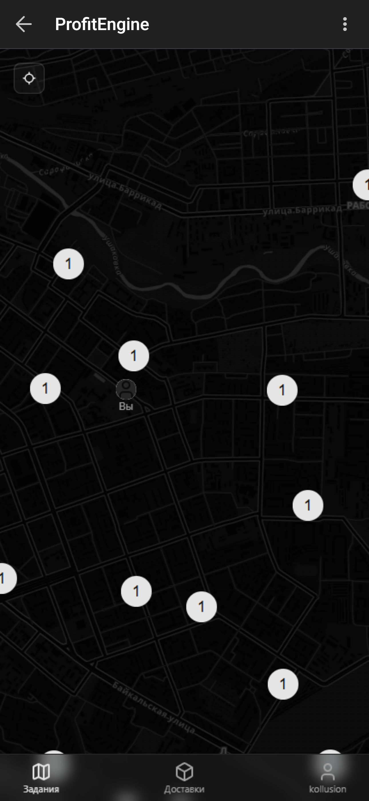
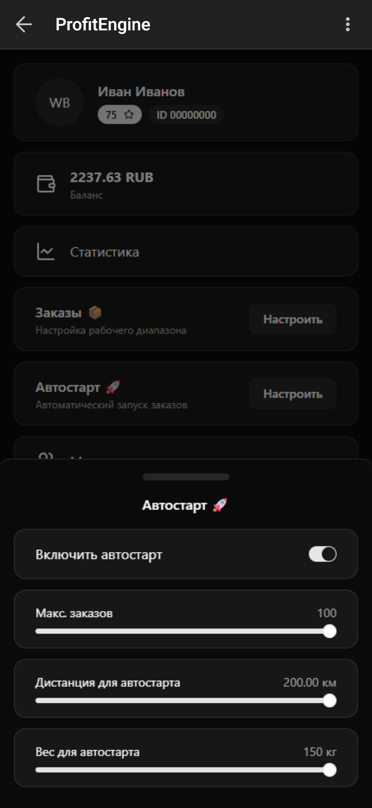
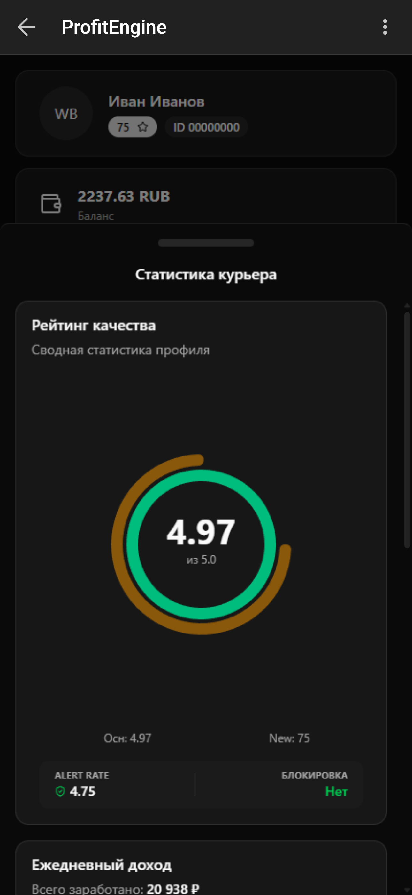
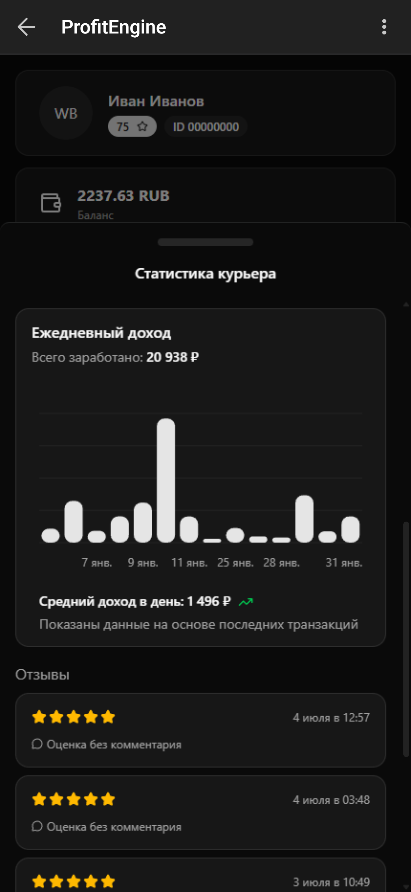
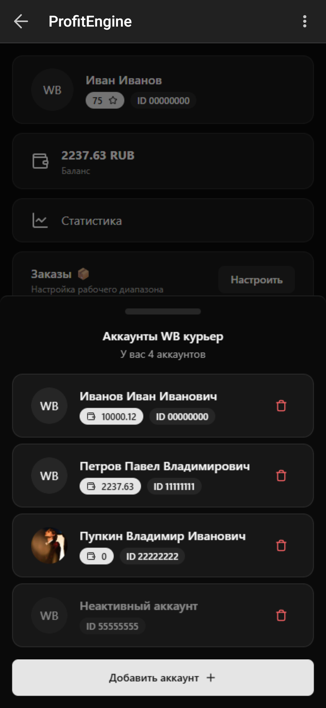
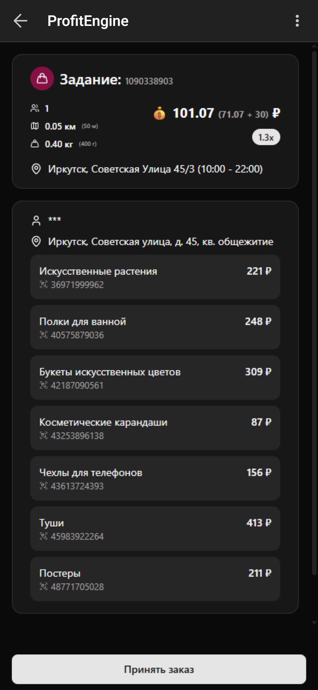

  

  # ⚡ ProfitEngine

  **Профессиональная экосистема автоматизации для курьеров Wildberries**

  

    
    
    
  

  <h3>
    <a href="https://t.me/Profit_enginebot">🌐 TG WebApp</a>
     • 
    <a href="#-галерея">📸 Интерфейс</a>
     • 
    <a href="#-установка">📥 Скачать Клиент</a>
  </h3>

  

    <i>Перестань бороться за заказы вручную. Пусть алгоритмы работают на тебя.</i>
  

---

## 🚀 О продукте

**ProfitEngine** — это не просто "бот", это решение, которое полностью меняет подход к работе курьера. 

Мы интегрируемся в нативный клиент WB через модифицированный APK, перехватываем поток данных и позволяем управлять заказами через удобный интерфейс прямо внутри Telegram.

### 🏆 Killer Features

| Фича | Описание |
| :--- | :--- |
| **🚀 Smart Autostart** | Забудьте про ручной мониторинг. Бот сам поймает заказ по вашим фильтрам быстрее человека. |
| **📍 Fake GPS** | Выставляйте свое местоположение в любой точке карты, не выходя из дома.|
| **📦 X-Ray Vision** | Видите содержимое заказа и отзывы о себе.|
| **👥 Multi-Account** | Управляйте парком аккаунтов с одного устройства. Приоритетная раздача заказов между своими профилями. |
| **🛡️ Anti-Fraud AI** | Эмуляция поведения реального человека. Система защиты от банов анализирует паттерны и маскирует активность бота. |

---

## 📸 Галерея

Управляйте всем через современный UI прямо в Telegram.

  <table>
    <tr>
      <td align="center"> <b>Карта заказов</b></td>
      <td align="center"> <b>Настройка Автолова</b></td>
      <td align="center"> <b>Рейтинг курьера</b></td>
    </tr>
    <tr>
      <td align="center"> <b>Статистика и отзывы</b></td>
      <td align="center"> <b>Мультиаккаунтинг</b></td>
      <td align="center"> <b>Информация о заказе</b></td>
    </tr>
  </table>

---

## 🏗 Технический стек

### Backend & Core
*    **Deno** — Высокопроизводительный Runtime.
*    **MongoDB + Mongoose** — Надежное хранение данных.
*    **GrammY** — Лучший фреймворк для Telegram ботов.

### Frontend (TMA)
*    **Next.js + React** — Реактивный интерфейс.
*    **Tailwind CSS + Shadcn/UI** — Премиальный дизайн.
*    **Zustand** — Управление состоянием.
*    **Leaflet** — Интерактивные карты.

### Client Builder (Этот репо)
*   **TypeScript** + **GitHub Actions** — CI/CD пайплайн для автоматической сборки и патчинга APK.

---

## 📥 Установка

   
  
   
  <a href="https://github.com/kollakek1/ProfitEngineBuilder/releases/latest">
    или скачать APK вручную с GitHub
  </a>
    

1.  **Скачайте приложение:** Нажмите на синюю кнопку выше. Откроется страница загрузки последней версии.
2.  **Установите:** Разрешите установку из неизвестных источников.
3.  **Авторизуйтесь:** Войдите в свой аккаунт WB Курьер через приложение.
4.  **Запустите бота:** Откройте <a href="https://t.me/Profit_enginebot">Telegram бота</a>, выберите тарифный план и наслаждайтесь ProfitEngine.

> ⚠️ **Важно:** Это модифицированный клиент. Не обновляйте его через Play Market или RuStore, иначе функции ProfitEngine пропадут. Обновления приходят через нашего бота.

---

## 🛡️ Безопасность и Приватность

Мы серьезно относимся к безопасности ваших аккаунтов.

*   **Hybrid Connection:** Основной трафик идет напрямую с вашего устройства на сервера WB, имитируя поведение обычного приложения.
*   **No Logs:** Мы не храним логи ваших действий дольше, чем это необходимо для сессии.
*   **Smart Headers:** Система автоматически подменяет заголовки устройства, чтобы избежать обнаружения модификации.
---

  Designed & Developed by <a href="https://github.com/kollakek1">@kollakek1</a>

